# Architecture

Current-state view of the SweetRPG platform: frontends, backend APIs, async processors,
messaging, and data stores. Generated from the platform `README.md` and
`docs/messaging-nats.md` (2026-09-09). Regenerate when services or their wiring change.

```mermaid
flowchart TB
    subgraph ext["External"]
        auth0["Auth0<br/>identity provider"]
    end

    subgraph fe["Frontends — dev.sweetrpg.com"]
        mainweb["main-web<br/>Rust · /"]
        authweb["auth-web<br/>Swift/Vapor · /auth"]
        catweb["catalog-web<br/>/catalog"]
        gsweb["game-systems-web<br/>Rust/Axum · /game-systems"]
        adminweb["admin-web<br/>Swift/Vapor · /admin"]
        usersweb["users-web<br/>Swift"]
        sharedweb["shared-web<br/>branded /errors/&#42;"]
        assetsweb["assets-web<br/>/assets"]
        grweb["game-room-web<br/>Python"]
        dirweb["directory-web<br/>Ember.js"]
        initweb["initiative-web<br/>Python"]
    end

    subgraph svc["Backend APIs"]
        adminapi["admin-api<br/>Go · banners"]
        authapi["auth-api<br/>Swift · POST /authz/check"]
        catapi["catalog-api<br/>Go · JSON:API"]
        gsapi["game-systems-api<br/>Go/Gin"]
        usersapi["users-api<br/>Swift · profiles"]
        grapi["game-room-api<br/>Python"]
        dirapi["directory-api<br/>Swift/Vapor"]
        initapi["initiative-api"]
        playersapi["players-api<br/>Swift/Vapor"]
        kvapi["kv-api"]
    end

    subgraph async["Async processing (Knative)"]
        cdp["catalog-data-processor<br/>Python"]
        kvexpr["kv-expression-processor<br/>Python"]
        kvkey["kv-key-processor<br/>Rust/actix"]
        kvcalc["kv-value-calculator<br/>Python"]
    end

    subgraph msg["Messaging"]
        nats["NATS + JetStream<br/>CATALOG_EVENTS · nats-system"]
        rabbit["RabbitMQ<br/>catalog ingest + KV pipeline"]
    end

    subgraph data["Data stores"]
        mongo[("MongoDB Atlas<br/>per-service DB user")]
        rediscache[("Redis<br/>per-service query cache")]
        redissess[("Redis<br/>shared session · sweetrpg-auth")]
    end

    %% Auth
    authweb <-->|"Authorization Code (OIDC)"| auth0
    authweb -->|"writes session"| redissess
    mainweb -.->|"reads session"| redissess
    catweb -.-> redissess
    gsweb -.-> redissess
    adminweb -.-> redissess
    usersweb -.-> redissess
    grweb -.-> redissess
    authapi -->|"JWKS verify"| auth0
    catapi -->|"/authz/check"| authapi
    adminapi -->|"/authz/check"| authapi
    grapi -->|"/authz/check"| authapi

    %% Frontend -> API
    catweb --> catapi
    gsweb --> gsapi
    usersweb --> usersapi
    grweb --> grapi
    dirweb --> dirapi
    initweb --> initapi
    adminweb --> adminapi
    adminweb --> authapi
    adminweb --> usersapi
    mainweb -.->|"banners (fail-open)"| adminapi
    catweb -.->|"banners (fail-open)"| adminapi

    %% Branded error pages (Traefik cross-namespace)
    mainweb -.->|"error pages"| sharedweb
    catweb -.-> sharedweb
    gsweb -.-> sharedweb
    adminweb -.-> sharedweb
    assetsweb -.-> sharedweb

    %% Service -> service
    catapi -->|"ruleset/edition lookup"| gsapi
    grapi -->|"bulk volume details"| catapi

    %% Data
    catapi --> mongo
    catapi --> rediscache
    adminapi -->|"TTL index"| mongo
    authapi --> mongo
    usersapi --> mongo
    grapi --> mongo

    %% Messaging
    catapi -->|"publish catalog.events.*.*"| nats
    nats -->|"consume volume.updated"| grapi
    rabbit --> cdp
    cdp -->|"ingested data"| catapi
    kvexpr --> rabbit
    kvexpr --> kvkey
    kvexpr --> kvcalc
    kvkey --> kvapi
    kvcalc --> kvapi

    classDef wip stroke-dasharray:5 4,opacity:0.55;
    class grweb,grapi,dirweb,dirapi,initweb,initapi,playersapi wip;
```

## Legend

- Solid arrow: synchronous request (HTTP / gRPC).
- Dashed arrow: asynchronous, optional, or fail-open dependency (session reads, banner
  fetches, event consumption, branded error-page routing).
- Faded nodes: designed but not yet functional (Game Room domain model undesigned;
  Directory / Initiative / Players are thin or undocumented).

## Notes

- `auth-web` is the only frontend that runs the Auth0 redirect/callback. It writes one
  shared session that every other frontend reads directly — one login is recognized
  suite-wide.
- Publishing to NATS is fail-open: a broker outage never fails the originating mutation.
  Consumers are durable, at-least-once, and must be idempotent.
- The KV pipeline runs its own RabbitMQ, separate from catalog ingestion.
- Deployment: ArgoCD syncs each service repo's `master`; the `kubernetes` repo holds the
  `Application` manifests. Traefik is the only ingress; there is no Istio.
